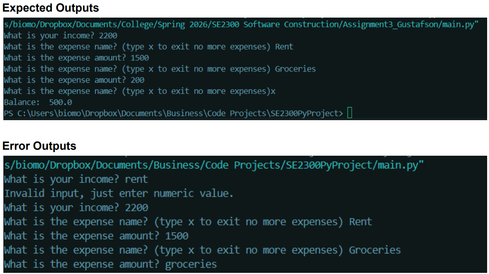

Welcome!

to run this program in your terminal you must make sure you have the most recent release of Python
https://www.python.org/downloads/

check if you already have Python run the command 'python --version' in terminal 

enter cd to find out what folder / directory you're currently in
navigate to the correct one, example: 
if downloaded program to Downloadds on Windows enter command

cd Downloads 

*later update to include instructions if you use tabulate table for main()

